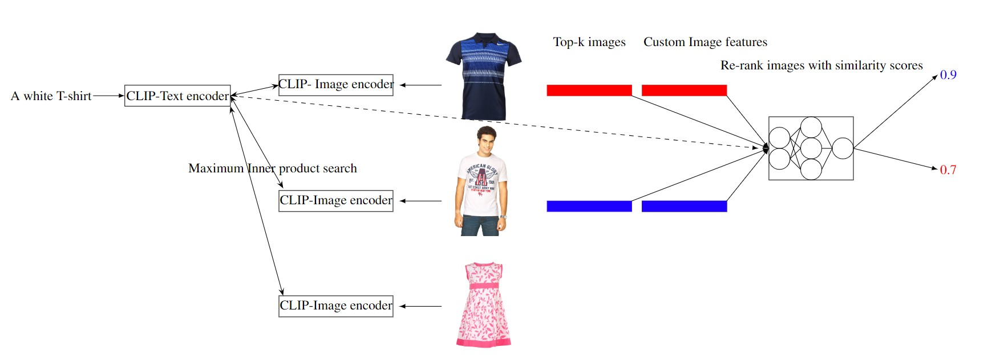

# CS682-Course-Project
## One size does not fit all: Improving Fashion Recommendation relevance via fit-aware Neural Re-ranking
Fashion recommendation systems are crucial for enhancing user experience and boosting sales through personalized suggestions. In this project, we aim to explore methods for improving the relevance of image retrieval systems given a textual description of custom needs for fashion recommendation. We plan to train neural networks in a learning to rank framework with custom features extracted from the images and the given query, to first retrieve set of all relevant images with high recall and further enhance the precision of the top-k retrieved items through re-ranking.

#### Our Pipeline:
In our project, we first retrieve images with high recall and use re-ranking with custom image features such as bounding box, sleeve length etc. along with the embeddings of original image and query to achieve better precision as shown below:


# Installation Steps

- Create a conda environment and activate it
- Use the following commands to install relevant packages:

```
- conda install numpy
- conda install anaconda::pillow
- conda install pytorch::pytorch
- conda install conda-forge::transformers
- conda install scikit-learn
```

## Notes (before you run the model):
 -> Run all the commands from `src` directory
 -> Make sure you have required files (images.csv, styles.csv) in the `datasets` folder


# Commands to run the models

- Create preprocessed data + generate CLIP (baseline) embeddings + Compute recall metric

```
    - python3 -m clip.main --num_examples {No of examples to be picked from Fashion30K} --k {No of results to be retrieved for a query}
```

- Run RCNN & KMeans for custom feature extraction

```
    - python3 -m clip.rcnn
    - python3 -m clip.dominant_color
```

- Run inference for CLIP (finetune) embeddings + Compute recall metric

    -> Make sure you have the checkpoint of the model in `models/` folder accordingly

```
    - python3 -m finetuning.main --task inference --num_examples {No of examples to be used from Fashion30K} --k {No of results to be retrieved for a query}
```


- Train Neural network with embeddings from above models

```
    - python3 -m neuralnetwork.main --task train --k {No of results present in the base model retrieved results} --base_model {Base model to use i.e clip or finetune}
```

